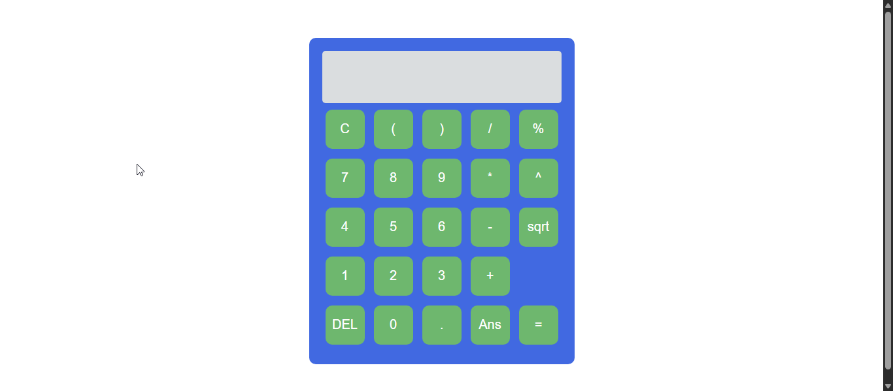
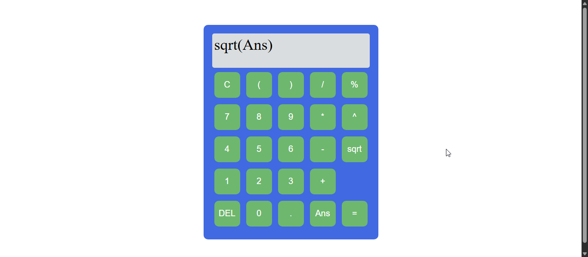

<h2>Calculator Shape</h2>

<h2>After write some numbers</h2>

<h2>After calculate it</h2>

Now Ans => 25

<h2>Used Ans with sqrt</h2>

<h2>After calculate it</h2>

<h2>After Write that</h2>

<h2>After clear last number</h2>

