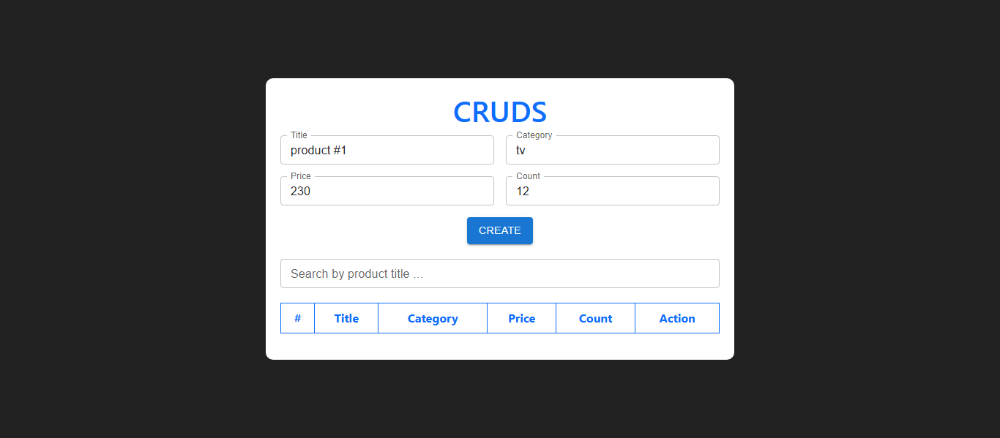
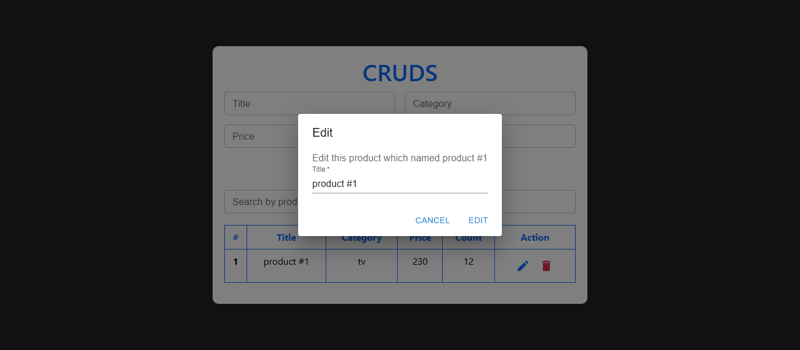
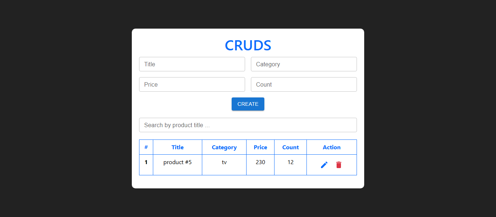
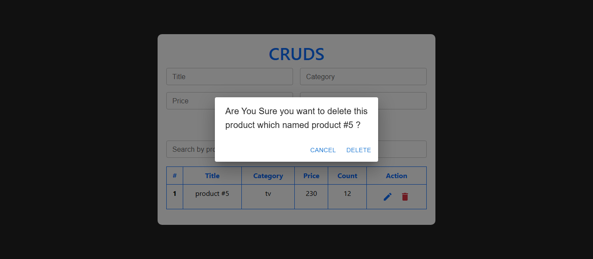

## Project Shape

## After write in inputs

## After Click "create" button

Look at inputs field => are empty 😉

## After Click "edit" button

Look at the name of title

## After Click "edit" button in dialog

## After Click "delete" button

Look at the name of title

